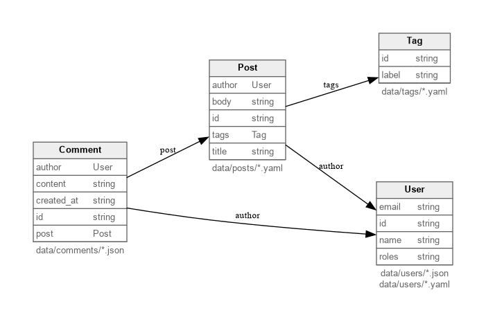

# Mergeway Example Repository

This repo is a tiny dataset that demonstrates how [`mergeway-cli`](https://github.com/mergewayhq/mergeway-cli) can describe and validate structured content.

## Getting started

You can either install the CLI yourself (see the instructions on the Mergeway website) or use the ready-to-use [Nix](https://nixos.org/) environment included here.

1. **Choose how you want to run mergeway-cli**

   - **Use your own install:** Follow the official instructions on [the webpage](https://mergewayhq.github.io/mergeway-cli/) to install `mergeway-cli` globally, then run commands directly from this repo.
   - **Use the provided dev shell (optional):** Install [Nix](https://nixos.org/download) and optionally [direnv](https://direnv.net/). This builds `mergeway-cli` from source and provides pre-commit hooks that include validation and formatting.

2. **Clone the repo**

   ```bash
   git clone git@github.com:mergewayhq/mergeway-example-repo.git
   cd mergeway-example-repo
   ```

3. **Use the CLI**

   - If you use the provided dev shell, you can start the shell manually from the root with `nix develop`. The development shell gives you access to `mergeway-cli` and the pre-commit hooks that include validation and formatting.
   - Run `mergeway-cli` (or it's alias `mw`) directly:

     ```bash
     # Show usage information
     mergeway-cli --help

     # Print the version
     mergeway-cli version

     # Validate the data repository
     mergeway-cli validate

     # Format all data files
     mergeway-cli fmt

     # Generate an entity relationship diagram
     mergeway-cli erd --output mergeway-erd.png
     ```

   - The CLI reads `mergeway.yaml`, loads every entity under `entities/`, and then validates the records in `data/`. You can now run any other `mergeway-cli` subcommands while staying inside the shell.

## Dummy data structure

The repository models a minimal blog with authors, tags, posts, and comments. Everything lives under `entities/` (schema) and `data/` (records), tied together from the top-level `mergeway.yaml`.



| Entity    | Files included                              | Key fields & relationships                                                                                        |
| --------- | ------------------------------------------- | ----------------------------------------------------------------------------------------------------------------- |
| `User`    | `data/users/*.yaml` and `data/users/*.json` | `id`, `name`, `email`, and repeated `roles`. Other entities reference users via the `id`.                         |
| `Tag`     | `data/tags/*.yaml`                          | `id` plus a human-friendly `label`. Posts list tags by `id`.                                                      |
| `Post`    | `data/posts/*.yaml`                         | `id`, `title`, `body`, `author` (must match a `User.id`), and repeated `tags` (must match `Tag.id`).              |
| `Comment` | `data/comments/*.json`                      | `id`, `post` (links to `Post.id`), `author` (links to `User.id`), `content`, and ISO8601 `created_at` timestamps. |

A sample directory tree:

```
data/
├── users/      # Alice, Bob, and other authors/editors
├── tags/       # Controlled vocabulary such as tag-product
├── posts/      # Markdown-friendly YAML files with body content
└── comments/   # JSON records keyed by comment id
entities/
├── User.yaml
├── Tag.yaml
├── Post.yaml
└── Comment.yaml
```

Each entity definition specifies the include globs and field metadata Mergeway should enforce.
For example, `entities/Post.yaml` declares that `author` must be a `User` and `tags` are repeated `Tag` references.

When you run `mergeway-cli`, those constraints are validated against the sample data so you can see how Mergeway handles relationships across heterogeneous file formats (YAML and JSON).

Use this structure as a template when experimenting with Mergeway—drop new files into `data/`, adjust the schemas in `entities/`, and re-run `mergeway-cli` to confirm everything stays consistent.
